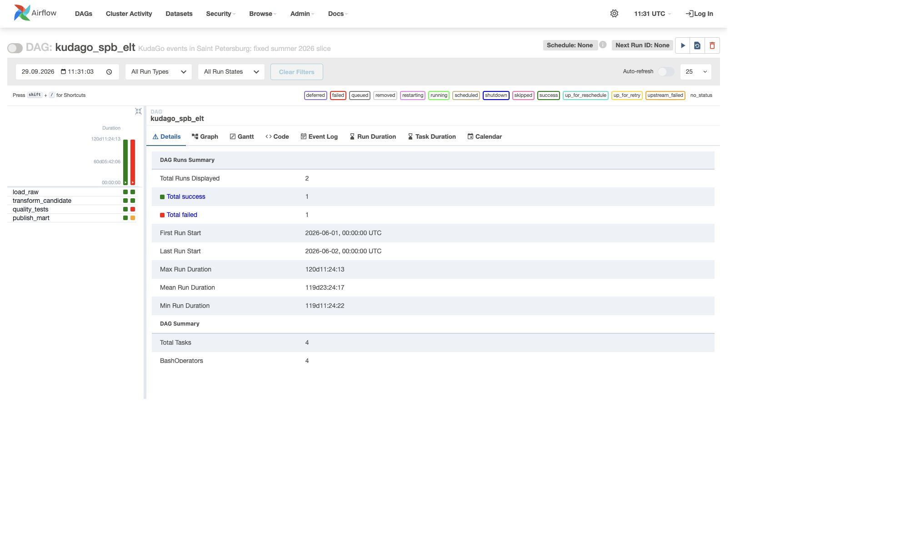
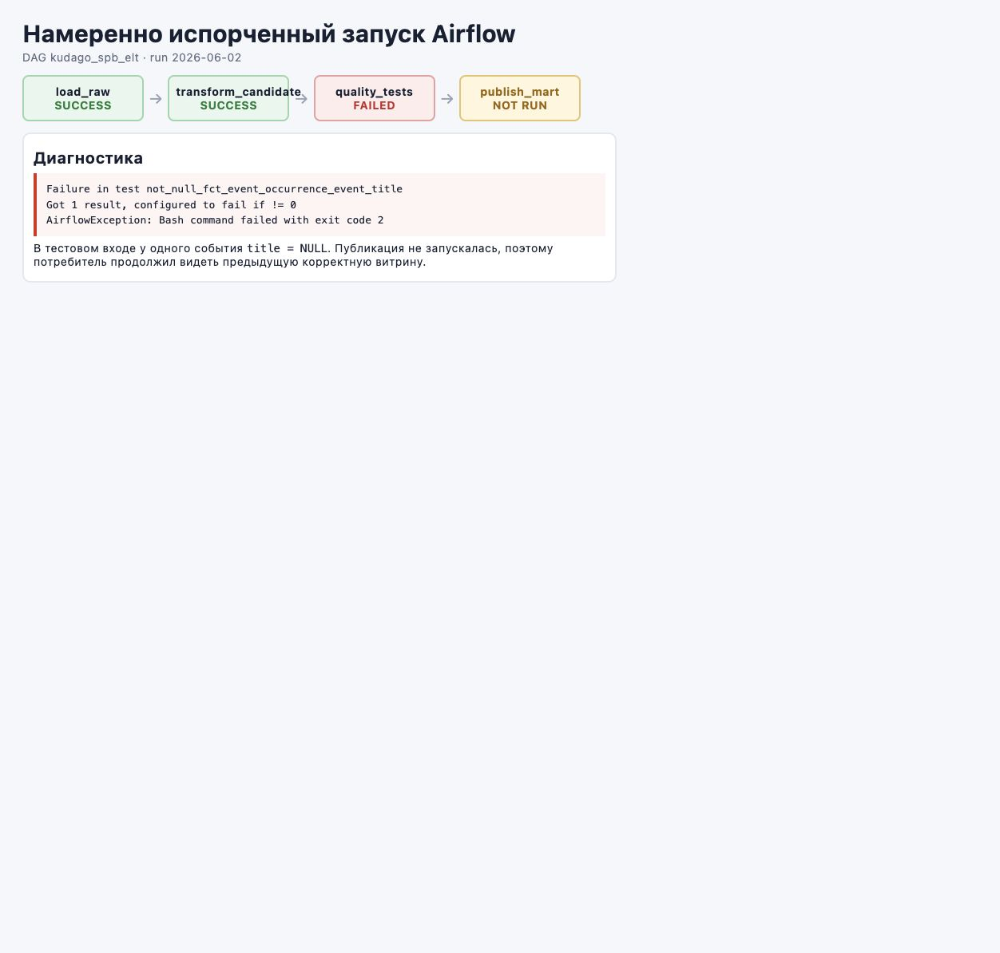
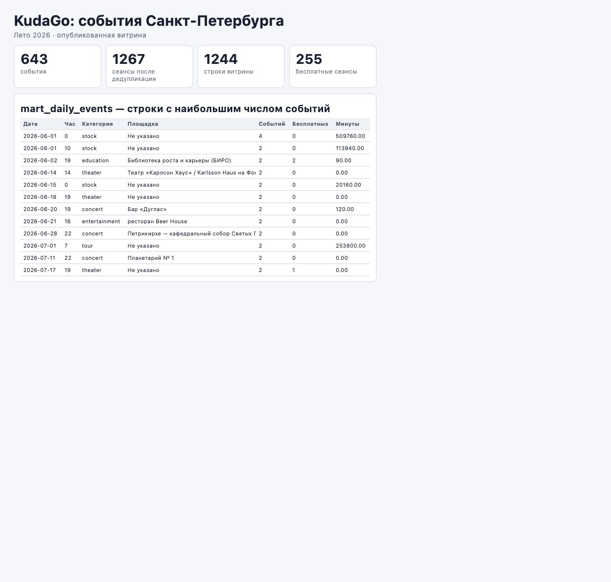
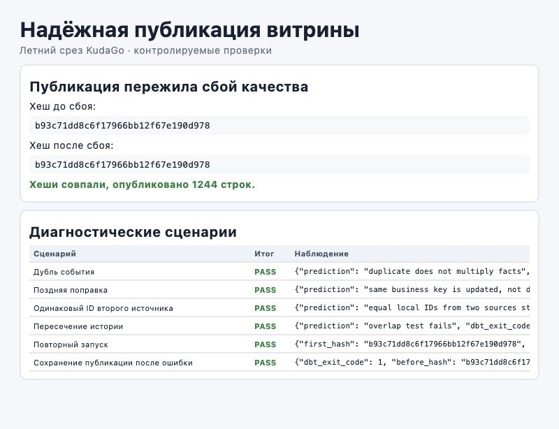

# DWH по событиям Санкт-Петербурга

## Задача

Потребитель — владелец бота с рекомендациями городских событий. Ему важно
понимать, какие категории и площадки активны, когда проходит больше событий
и сколько среди них бесплатных вариантов.

MVP — витрина `analytics_public.mart_daily_events`.

## Данные

Источник — открытый [KudaGo API](https://kudago.com/public-api/v1.4/events/).
Зафиксирован срез Санкт-Петербурга за лето 2026 года: с 1 июня включительно
до 1 сентября не включительно.

- `location=spb`;
- `actual_since=1780261200`, `actual_until=1788209999`;
- сортировка `-publication_date`, размер страницы 100, все страницы;
- часовой пояс событий — `Europe/Moscow`;
- длительность рассчитывается в минутах.

API вернул 821 событие, пересекающее период. После фильтрации отдельных
расписаний по времени начала в летнем диапазоне осталось 643 события и
1269 записей `dates`. Два расписания повторяют бизнес-ключ, поэтому в факте
1267 строк. JSON лежит в `data/source/kudago_spb_summer_2026.json`.
SHA-256 файла:
`d6883895f139fc26454f5c8ea3dc6105192926c88d7573a63e5fdab33a8eb78e`.

Основные поля: `id`, `title`, `dates`, `categories`, `place`, `is_free`,
`age_restriction`. Вход можно воспроизвести командой `make download`.

## Модель

Одна строка факта — один сеанс события в конкретное время.
Бизнес-ключ: `source_system + event_id + start_at`.

```text
raw.kudago_events
        ↓
stg_kudago_event_occurrences
        ↓
dim_date ─────┐
dim_category ─┼─ fct_event_occurrence → mart_daily_events
dim_place ────┘
```

Каждая запись факта относится к одной дате, одной категории и одной площадке;
каждое измерение связано с несколькими фактами (`1:N`). Размерная модель
подходит для простых аналитических срезов. Для хранения исходных документов
или сложных связей между несколькими категориями понадобилась бы другая модель.

Физические слои:

- Raw — `raw.kudago_events`;
- ODS/staging — view `analytics_candidate.stg_kudago_event_occurrences`;
- DDS — измерения и факт в `analytics_candidate`;
- кандидат витрины — `analytics_candidate.mart_daily_events`;
- публикация — `analytics_public.mart_daily_events`.

Площадка хранится как SCD Type 1: остаётся последнее загруженное название.
Реальной истории KudaGo нет, поэтому SCD Type 2 показан отдельным синтетическим
seed: интервалы `[valid_from, valid_to)` одной площадки не должны пересекаться.

## Пайплайн

```text
load_raw → transform_candidate → quality_tests → publish_mart
```

Python загружает JSON без бизнес-преобразований. PostgreSQL выполняет SQL,
dbt строит модели и запускает проверки, Airflow управляет порядком. Поэтому
это ELT.

Витрина сначала строится в `analytics_candidate`. Только после успешных тестов
`publish.py` атомарно заменяет таблицу в `analytics_public`. При ошибке
потребитель продолжает видеть предыдущую корректную публикацию.

DAG запускается вручную (`schedule=None`) и не подменяет дату события датой
запуска. Для ежедневного расписания логическая дата Airflow определяла бы
обрабатываемый день, но в этой работе всегда используется явно заданный
летний файл. `max_active_runs=1` запрещает параллельные запуски.

## Структура

```text
data/source/       зафиксированный вход
models/            dbt-модели
tests/             SQL-тесты dbt
seeds/             синтетическая история площадки
scripts/           скачивание, загрузка, публикация, диагностики
dags/              Airflow DAG
sql/               аналитические запросы
evidence/          результаты и скриншоты
Makefile           все команды проекта
```

## Запуск

Нужны macOS, Python 3.11 и PostgreSQL 14 из Homebrew.

```bash
make setup
make download      # повторно получить летний срез из KudaGo
make pipeline
```

Основные команды:

```bash
make test          # загрузка и полный dbt build
make diagnostics   # обязательные диагностические сценарии
make airflow-test  # локальный тест DAG
make airflow       # Airflow UI
make stop          # остановить PostgreSQL, созданный этим проектом
```

dbt и Airflow установлены в разные виртуальные окружения, чтобы их зависимости
не конфликтовали.

## Качество и диагностики

Проверяются заполненность и уникальность ключей, связи факта с измерениями,
допустимые категории и источники, порядок начала и конца события, а также
отсутствие пересечений истории площадки.

`scripts/run_diagnostics.py` создаёт изменения из основного JSON в памяти:

- дубль события не увеличивает 1267 фактов;
- поздняя поправка меняет длительность со 180 до 240 минут без нового факта;
- одинаковый ID двух источников остаётся двумя разными сущностями;
- пересекающаяся версия площадки приводит к ожидаемому падению SCD2-теста;
- два одинаковых запуска дают хеш `b93c71dd8c6f17966bb12f67e190d978`;
- `NULL` в названии останавливает тесты и не изменяет публикацию.

Результат сохраняется в `evidence/diagnostics.json`.

## SQL-ответы

Запросы и проверка повторного запуска находятся в `sql/analysis.sql`.

1. Максимум — 16 концертов 21 августа.
2. Среди названных площадок больше всего сеансов у Петрикирхе — 56.
3. Бесплатных сеансов 255 из 1267, или 20,1%.
4. Независимая сверка: 1269 записей `dates` дают 1267 уникальных
   бизнес-ключей и 1267 строк факта.

## Скриншоты

Успешный и намеренно сломанный запуски одного DAG:



Ошибка `not_null` останавливает пайплайн до публикации:



Опубликованная летняя витрина содержит 1244 агрегированные строки:



Хеш публикации не изменился после сбоя качества:



## Ограничения

- используется только первая категория события;
- отсутствующая площадка заменяется на «Не указано»;
- отсутствующая длительность считается нулём только в агрегатной витрине;
- уникальность ключей не доказывает полноту выгрузки;
- SCD Type 2 проверяется на синтетической, а не реальной истории.
